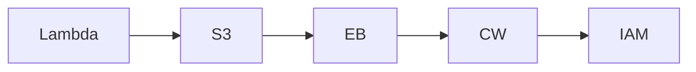

# InfraTales | AWS Config Custom Rules with CDK TypeScript: Enforce Lambda Timeout and IAM Key Compliance

**AWS CDK TYPESCRIPT reference architecture — security pillar | advanced level**

> Your security team asks for proof that no IAM user has a live access key and no Lambda runs longer than 5 minutes — and you need that proof continuously, not just at audit time. Stitching together Config rules, custom evaluators, and remediation workflows by hand produces brittle one-off scripts that break on the next deploy. This stack codifies those guardrails as versioned CDK infrastructure so compliance is structural, not ceremonial.

[](LICENSE)
[](CONTRIBUTING.md)
[](https://aws.amazon.com/)
[](https://aws.amazon.com/cdk/)
[](https://infratales.com/p/369f7ac3-7c83-48e4-b656-e6951c086680/)
[](https://infratales.com)


## 📋 Table of Contents

- [Overview](#-overview)
- [Architecture](#-architecture)
- [Key Design Decisions](#-key-design-decisions)
- [Getting Started](#-getting-started)
- [Deployment](#-deployment)
- [Docs](#-docs)
- [Full Guide](#-full-guide-on-infratales)
- [License](#-license)

---

## 🎯 Overview

AWS Config sits at the center, recording all resource changes and routing configuration-item events to two Python Lambda evaluators: one that checks every Lambda function's timeout against a 300-second ceiling, and one that calls IAM APIs to detect users with active access keys. Evaluation results flow back to Config, and a separate remediation Lambda — triggered by Config compliance events via EventBridge — writes an audit entry to both CloudWatch Logs and S3 before touching anything. Compliance snapshots land in a dedicated S3 bucket with a three-tier lifecycle (Standard → IA at 90 days → Glacier at 365 → Deep Archive at 730) and hard expiration at 2,555 days. A LocalStack detection flag swaps Config triggers for EventBridge alternatives during local development, which is the non-obvious part most teams skip entirely.

**Pillar:** SECURITY — part of the [InfraTales AWS Reference Architecture series](https://infratales.com).
**Target audience:** advanced cloud and DevOps engineers building production AWS infrastructure.

---

## 🏗️ Architecture



> 📐 See [`diagrams/`](diagrams/) for full architecture, sequence, and data flow diagrams.

> Architecture diagrams in [`diagrams/`](diagrams/) show the full service topology (architecture, sequence, and data flow).
> The [`docs/architecture.md`](docs/architecture.md) file covers component responsibilities and data flow.

---

## 🔑 Key Design Decisions

- allSupported: true on the Config recorder captures every resource type, including ones you don't care about — Config pricing is per configuration item recorded, so in accounts with frequent EC2 or ECS churn this can spike costs unexpectedly [from-code]
- Deep Archive transition at 730 days cuts storage cost to ~$0.00099/GB/month but retrieval takes 12 hours — any compliance audit that needs data older than 2 years will block until restore completes [inferred]
- Running evaluators as Lambda functions means cold starts add latency to the evaluation pipeline; if Config batches many items simultaneously you can hit Lambda concurrency limits and push evaluations past the 15-minute SLA window [inferred]
- includeGlobalResourceTypes: true forces Config to record IAM resources but is only supported in the home region — deploying this stack to multiple regions without a guard will cause a CloudFormation error in secondary regions [inferred]
- Remediation Lambda writes to S3 and CloudWatch Logs before making changes, which is correct for auditability but means a failed S3 write silently blocks remediation unless the error path is explicitly handled [editorial]

> For the full reasoning behind each decision — cost models, alternatives considered, and what breaks at scale — see the **[Full Guide on InfraTales](https://infratales.com/p/369f7ac3-7c83-48e4-b656-e6951c086680/)**.

---

## 🚀 Getting Started

### Prerequisites

```bash
node >= 18
npm >= 9
aws-cdk >= 2.x
AWS CLI configured with appropriate permissions
```

### Install

```bash
git clone https://github.com/InfraTales/<repo-name>.git
cd <repo-name>
npm install
```

### Bootstrap (first time per account/region)

```bash
cdk bootstrap aws://YOUR_ACCOUNT_ID/YOUR_REGION
```

---

## 📦 Deployment

```bash
# Review what will be created
cdk diff --context env=dev

# Deploy to dev
cdk deploy --context env=dev

# Deploy to production (requires broadening approval)
cdk deploy --context env=prod --require-approval broadening
```

> ⚠️ Always run `cdk diff` before deploying to production. Review all IAM and security group changes.

---

## 📂 Docs

| Document | Description |
|---|---|
| [Architecture](docs/architecture.md) | System design, component responsibilities, data flow |
| [Runbook](docs/runbook.md) | Operational runbook for on-call engineers |
| [Cost Model](docs/cost.md) | Cost breakdown by component and environment (₹) |
| [Security](docs/security.md) | Security controls, IAM boundaries, compliance notes |
| [Troubleshooting](docs/troubleshooting.md) | Common issues and fixes |

---

## 📖 Full Guide on InfraTales

This repo contains **sanitized reference code**. The full production guide covers:

- Complete AWS CDK TYPESCRIPT stack walkthrough with annotated code
- Step-by-step deployment sequence with validation checkpoints
- Edge cases and failure modes — what breaks in production and why
- Cost breakdown by component and environment
- Alternatives considered and the exact reasons they were ruled out
- Post-deploy validation checklist

**→ [Read the Full Production Guide on InfraTales](https://infratales.com/p/369f7ac3-7c83-48e4-b656-e6951c086680/)**

---

## 🤝 Contributing

See [CONTRIBUTING.md](CONTRIBUTING.md) for guidelines. Issues and PRs welcome.

## 🔒 Security

See [SECURITY.md](SECURITY.md) for our security policy and how to report vulnerabilities responsibly.

## 📄 License

See [LICENSE](LICENSE) for terms. Source code is provided for reference and learning.

---

<p align="center">
  Built by <a href="https://infratales.com">InfraTales</a> — Production AWS Architecture for Engineers Who Build Real Systems
</p>
